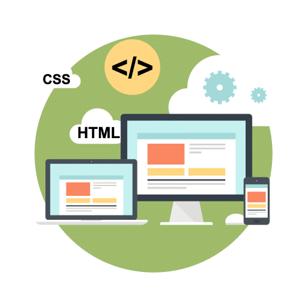

# Maquetación web con HTML 5 + CSS
> Curso de Maquetado Web |   
> Miércoles y Viernes 18hs a 20hs (Arg) |  
> Código: 58703 |  
> sensei: Marcos Pinardi |

## Definición

Maquetado web es: volcar a código HTML y CSS el proyecto web que vayamos a relizar.

## Requisitos de software

1. un browser
2. un IDE o Editor de código

   a. Sublime Text 4 https://www.sublimetext.com/   
   b. Visual Studio Code https://code.visualstudio.com/  
   c. Brackets http://brackets.io/    
   d. Atom https://atom.io/  
   e. Playcode https://playcode.io/  
   f. Codeanywhere https://codeanywhere.com/

## Fórmulas
> Fórmula del HTML    

    <elemento atributo="valor">    
      objeto   
    </elemento>

> Fórmula del CSS  
 
    selector{
      atributo: valor;
    } 

# Tipos de selectores
  1. de etiqueta  
  2. de id
  3. de class

### 1. Selector de Etiqueta
>El selector de etiqueta se escribe igual que la etiqueta pero sin < >  
> y sirve para modificar la estética de una etiqueta ***cada vez*** que aparezca

## 2. Selector de ID
> El selector de ID sirve para modificar un elmento ***único*** en el HTML

## 3. Selector de clase
> El selector de clase, por oposición el selector de ID, se uitliza para modificar elementos ***que se repiten*** en el HTML  